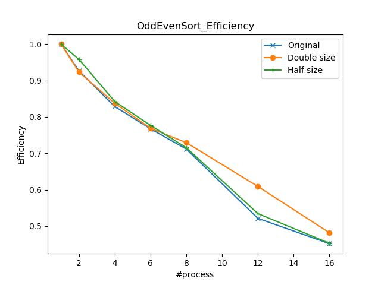

# ParallelApp_MPI
Assignment for Parallel Programming using C++ and MPI
## Introduction
- `Matrix.h` and `Matrix.cpp` conduct Matrix-Vector Multiplication.
- `Trap.h` and `Trap.cpp` conduct Trapezoidal Integral.
- `OddEvenSorting.h` and `OddEvenSorting.cpp` conduct Odd Even Sort.
- `MPIApp.cpp` contains the main function.
## Usage
- compile with mpic++ (*using c++11 with argument* `-std=c++11`)
```bash
mpic++ -std=c++11 -c Matrix.cpp Trap.cpp OddEvenSorting.cpp MPIApp.cpp
```
- link with g++
```bash
mpic++ -o Matrix.o Trap.o OddEvenSorting.o MPIApp.o app
```

- use app
```bash
# default arguments:
#     total = 10000
#     m = 500
#     n = 500
mpirun -np $(#process) app 1  # test Matrix-Vector Multiplication
mpirun -np $(#process) app 1 $(total)  # specify the total number of tests
mpirun -np $(#process) app 1 $(m) $(n)  # specify the shape (m*n) of the matrix
mpirun -np $(#process) app 1 $(total) $(m) $(n)  # specify the total number of tests, and the shape (m*n) of the matrix
```

```bash
# default arguments:
#     total = 10000
#     range = 100
#     n = 1000000
mpirun -np $(#process) app 2  # test Trapezoidal Integral
mpirun -np $(#process) app 2 $(range) $(n)  # specify the range of the integral interval and the number of trapezoids
mpirun -np $(#process) app 2 $(total) $(range) $(n)  # specify the total number of tests, the range of the integral interval and the number of trapezoids
```

```bash
# default arguments:
#     total = 10000
#     n = 10000
mpirun -np $(#process) app 3  # test Odd Even Sort
mpirun -np $(#process) app 3 $(n)  # specify the list length
mpirun -np $(#process) app 3 $(total) $(n)  # specify the total number of tests and the list length
```

- __Any other command will be rejected by the application.__

## Comparisons between sequential process and parallel process.

- Matrix-Vector Multiplication


- Trapezoidal Integral


- Odd Even Sorting



